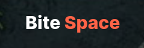
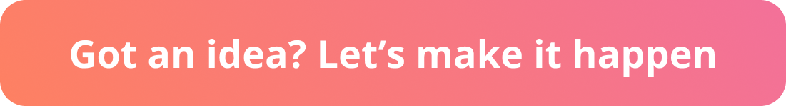

# Bite Space – Your Ultimate Culinary Companion!

Bite space is a platform, where users can discover new restaurants and cuisines, explore menus, and find their next favorite dish. Whether you're a foodie looking for your next culinary adventure or a restaurant owner seeking to expand your reach, Bite Space has you covered.

## Welcome to the Bite Space

A food web app for food lovers which is built in Next.js to discover popular foods and restaurants/cafés near you or where you want.

🍔 <b>Explore Culinary Delights:</b> Dive into a world of flavors with our curated collection of dishes. Discover local favorites, international delights, and recipes that cater to every palate.

📸 <b>Visual Feast:</b> Immerse yourself in a visual journey with stunning images of mouthwatering dishes. Every photo tells a story, inviting you to savor the artistry behind each culinary creation.

🍴 <b>Browse by Categories:</b> Users can explore all available categories, making it easy to find specific types of cuisine or dishes they're interested in.

🌮 <b>Browse Restaurants by Cuisines:</b> Users can browse restaurants categorized by cuisines, making it convenient to explore different culinary traditions.

📋 <b>Restaurant Menus:</b> Users have access to detailed restaurant menus, allowing them to peruse dishes and make informed decisions before dining out.

🤝 <b>Partner with Us:</b> Restaurant and café owners can easily partner with us to showcase their establishments and reach a wider audience of food enthusiasts.

📢 <b>About Us:</b> Learn more about Bite Space and its mission on our About Us page.

🌙 <b>Dark Mode:</b> Enjoy a visually comfortable experience with our dark mode feature, perfect for nighttime browsing or reducing eye strain.

We're actively working on Bite Space 🚧 and have exciting plans for future features,  
Stay tuned for these upcoming features to further enhance your Bite Space experience!

## Technologies Used

<b>Next.js:</b> A React framework for building server-side rendered and statically generated applications.

<b>Tailwind CSS:</b> A utility-first CSS framework for rapidly building custom designs.

<b>Supabase:</b> An open-source alternative to Firebase, providing backend services such as authentication, real-time database, and more.

## Project Structure
The project is divided into two main parts:

### Website
The website folder contains all the files related to the user-facing portion of the application. For more information on setting up and running the website, refer to the website [README](./website/README.md) file.

### Admin Panel
The admin panel folder houses all the files for managing restaurant data and accounts. For detailed instructions on setting up and using the admin panel, refer to the admin panel [README](./admin/README.md) file.

## Contributing
We welcome contributions from the community. To contribute to this project, please follow these guidelines:

- Fork the repository.
- Create a new branch for your feature or bug fix.
- Make your changes and commit them.
- Push your changes to your fork.
- Submit a pull request with a clear description of your changes.
- Please ensure your code follows the project's coding standards and includes appropriate documentation.

## Creating Issues

Found a bug or have a suggestion for improvement? We'd love to hear from you! Please create an issue on our [GitHub repository](https://github.com/canopas/bite-space/issues) and provide as much detail as possible. Your feedback helps us make Bite Space better for everyone!

## Credits

Bite Space is owned and maintained by the [Canopas team](https://canopas.com/). You can reach out to them on GitHub at [canopas](https://github.com/canopas) for questions or need support. You can follow them on Twitter at [@canopassoftware](https://twitter.com/canopassoftware) for more updates. If you are interested in building web apps or designing products, please let us know. We'd love to hear from you!

## License

This project is licensed under the [MIT](./LICENSE).
